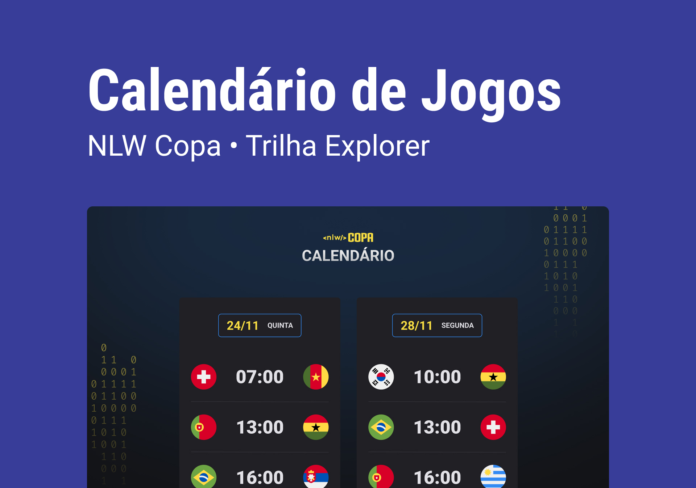

<h1 align="center"> NLW | Copa </h1>

Evento exclusivo e gratuito, promovido pela Rocketseat para ensino de tecnologias WEB.

  

 

  

## 🚀 Tecnologias

Esse projeto foi desenvolvido com as seguintes tecnologias:

- HTML e CSS
- JavaScript 
- Git e Github

## 💻 Projeto

O projeto Calendário da Copa foi desenvolvido no NLW Copa da Rocketseat  onde mostra os jogos da Copa de 2022

<h1 align="center">

## 🔖 Layout

Você pode visualizar o layout do projeto através [DESSE LINK](https://www.figma.com/file/u7u3YxQMEtaXMTh6f31Q89/Calend%C3%A1rio-de-Jogo). É necessário ter conta no [Figma](https://figma.com) para acessá-lo.